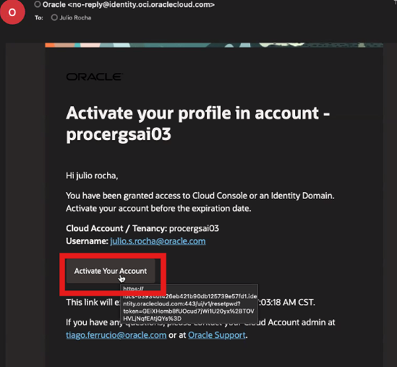
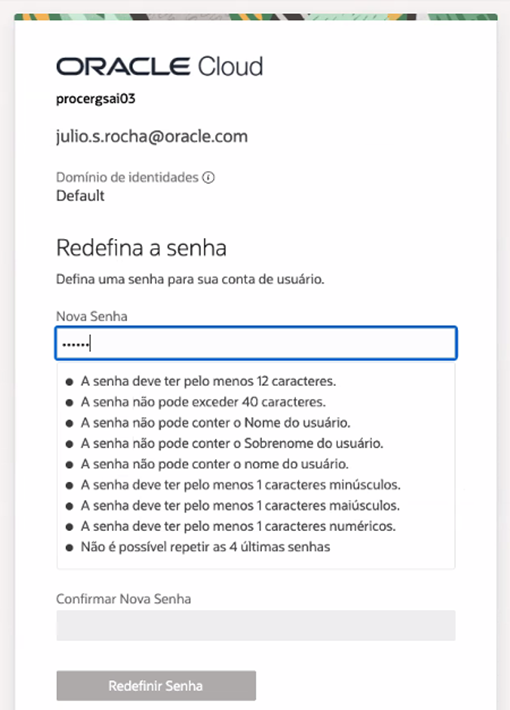
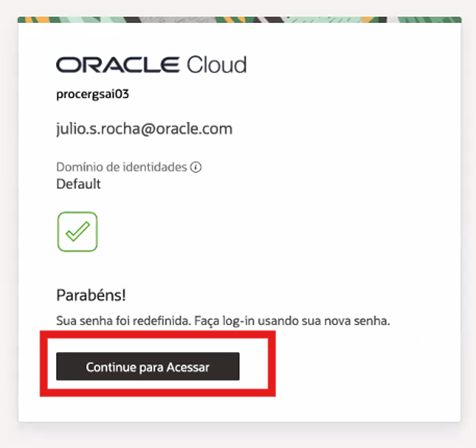
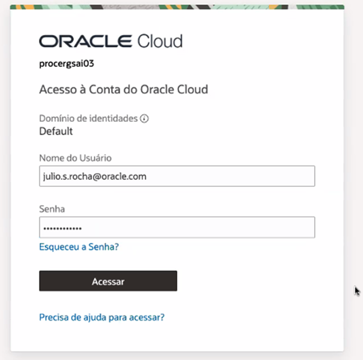
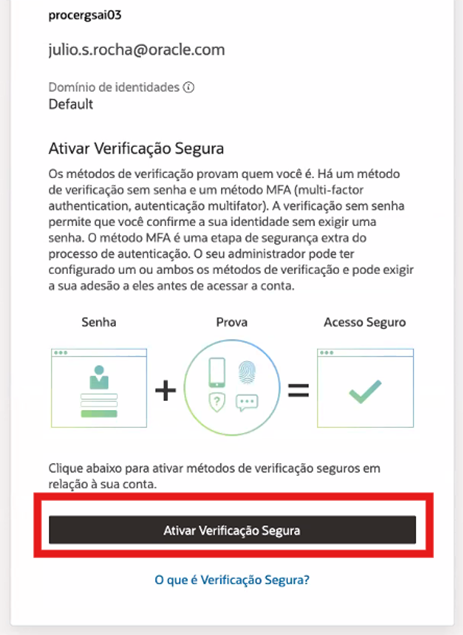
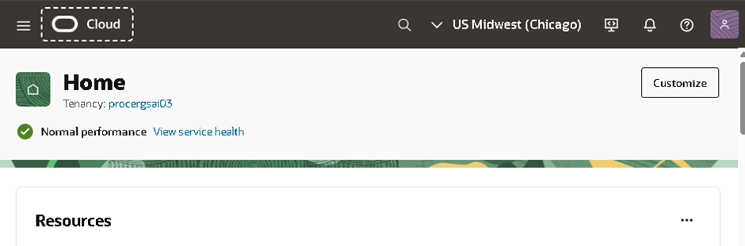
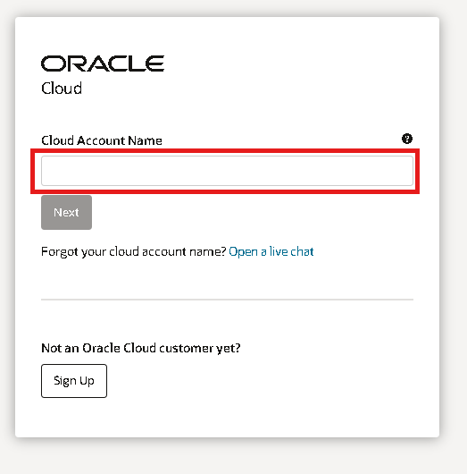
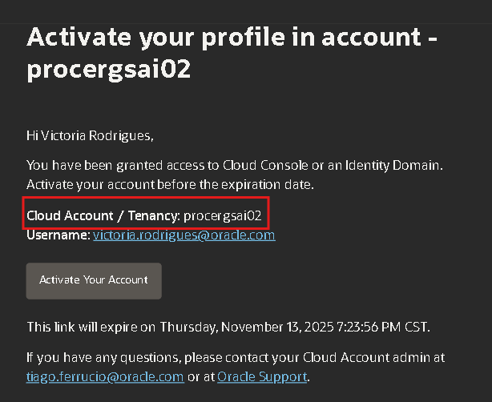
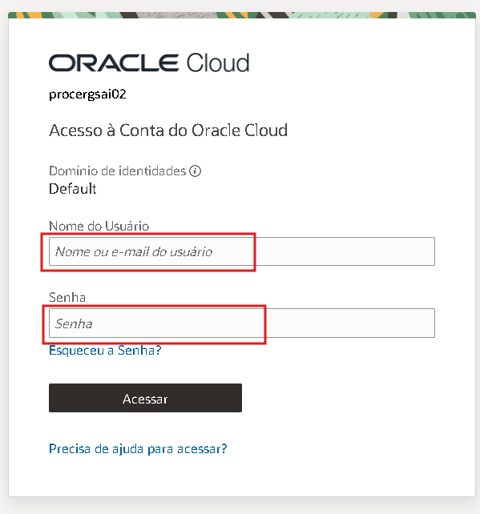
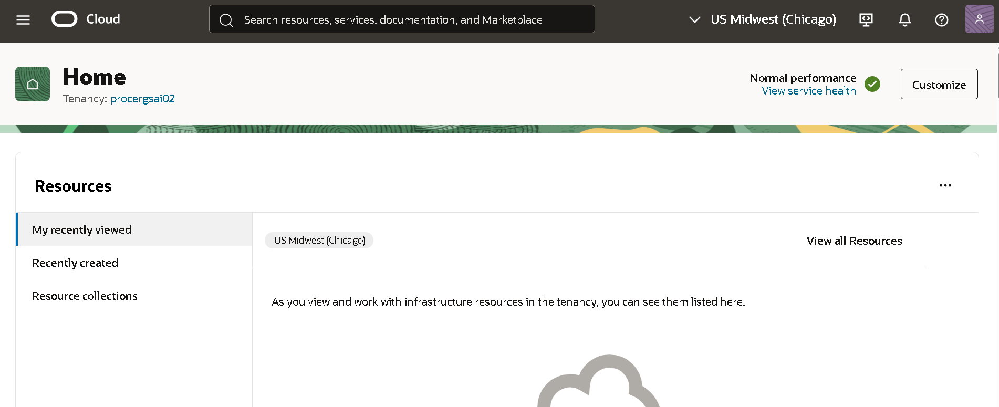

# Configuração do Oracle Cloud

## 📌 Introdução

> Este documento de configuração foi elaborado para guiar você na **ativação da sua conta Oracle Cloud**, que é necessária para realizar qualquer laboratório técnico na Oracle Cloud Infrastructure (OCI).

### ➡️ **O que é a Oracle Cloud?**

A [**Oracle Cloud**](https://www.oracle.com/br/cloud/) é uma plataforma de infraestrutura e serviços em nuvem que oferece uma ampla gama de capacidades para soluções de negócios, aplicações e desenvolvimento. Com a OCI, você pode aproveitar recursos de computação, armazenamento, bancos de dados, inteligência artificial, entre outros, tudo em um ambiente seguro e de alto desempenho.

<br>
### **Recursos e Suporte**:

- **Documentação da Oracle Cloud**: [Documentação da Oracle Cloud](https://docs.oracle.com/en/cloud/)
- **Tutoriais**: Explore o [Centro de Aprendizado da Oracle](https://mylearn.oracle.com/ou/home)

## 1️⃣ Ativação da Conta

Você receberá um e-mail semelhante ao exemplo abaixo. Caso não encontre, verifique se ele não está na pasta de spam. Em seguida, clique em **"Activate Your Account"** para continuar:




Faça redefinição da sua nova senha que será utilizada para acessar a Oracle Cloud. Anote para não esquecer no dia do evento.

Crie uma senha que atenda às seguintes regras:
   - A senha deve ter no mínimo **8 caracteres**, incluindo **1 letra minúscula**, **1 letra maiúscula**, **1 número** e **1 caractere especial**.
   - A senha não pode ter mais de **40 caracteres**, nem conter o **nome**, **sobrenome**, **endereço de e-mail**, **espaços** ou os caracteres: ``` ` ~ < > \ ```.




Clique em **Continuar para Acessar**:



Faça o login com seu e-mail cadastrado no evento e a senha que definiu anteriormente:



Na tela seguinte, clique em **Ativar Verificação Segura** para iniciar a configuração da verificação em duas etapas.



Selecione o método de autenticação **Mobile App** e busque por **Oracle Mobile Authenticator** na loja de aplicativos do seu celular.
   - [Link para Android](https://play.google.com/store/apps/details?id=oracle.idm.mobile.authenticator&hl=pt_BR&pli=1)
   - [Link para Iphone](https://apps.apple.com/br/app/oracle-mobile-authenticator/id835904829)

Configure o aplicativo de autenticação:
   - Abra o aplicativo no seu dispositivo móvel.
   - Toque em **Add Account ou +** e escaneie o código QR exibido na tela para vincular o aplicativo à sua conta.


Conclua o processo de configuração:
   - Após o aplicativo ser vinculado, você verá uma confirmação na tela com a mensagem **Successfully Enrolled**.
   - Clique em **Done** para finalizar o processo.


Após o login, você será redirecionado para o painel da Oracle Cloud.
  - Verifique se a **região selecionada** no canto superior direito é "US Midwest (Chicago)"



## 2️⃣ Acessar a conta 

Se você já realizou a ativação sua conta, basta acessar https://cloud.oracle.com/

No campo **Cloud Account Name** insira o nome do Account Name presente no e-mail de ativação.



Exemplo de onde encontrar o **Cloud Account / Tenancy** no e-mail:



Insira seu email e senha



Você receberá uma **notificação** no dispositivo configurado com o **Oracle Mobile Authenticator**. Abra a notificação e toque em **Allow** para continuar o login.


Após o login, você será redirecionado para o painel da Oracle Cloud.



## 👥 Agradecimentos

- **Autores** - Victória Rodrigues
- **Autor Contribuinte** - Isabelle Anjos,Caio Oliveira
- **Última Atualização Por/Data** - Novembro, 2025

## 🛡️ Declaração de Porto Seguro (Safe Harbor)

O tutorial apresentado tem como objetivo traçar a orientação dos nossos produtos em geral. É destinado somente a fins informativos e não pode ser incorporado a um contrato. Ele não representa um compromisso de entrega de qualquer tipo de material, código ou funcionalidade e não deve ser considerado em decisões de compra. O desenvolvimento, a liberação, a data de disponibilidade e a precificação de quaisquer funcionalidades ou recursos descritos para produtos da Oracle estão sujeitos a mudanças e são de critério exclusivo da Oracle Corporation.

Esta é a tradução de uma apresentação em inglês preparada para a sede da Oracle nos Estados Unidos. A tradução é realizada como cortesia e não está isenta de erros. Os recursos e funcionalidades podem não estar disponíveis em todos os países e idiomas. Caso tenha dúvidas, entre em contato com o representante de vendas da Oracle. 


