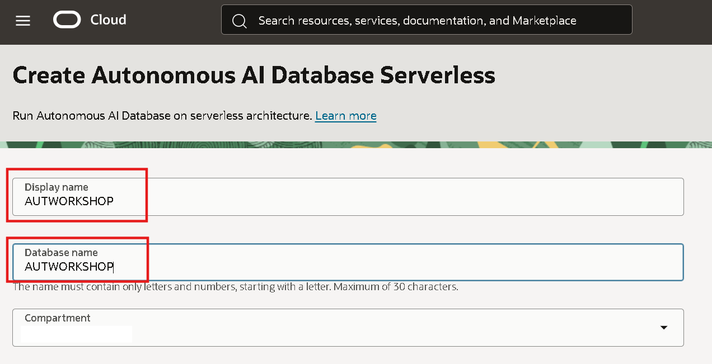
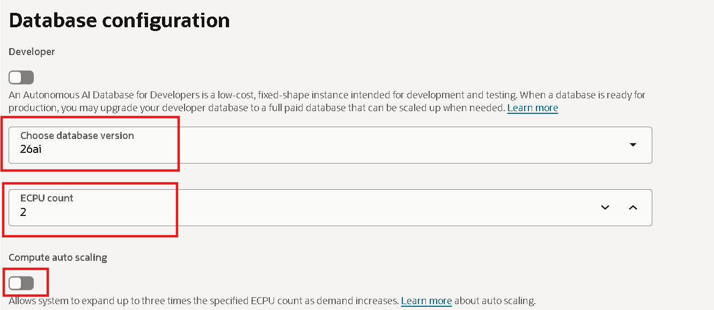
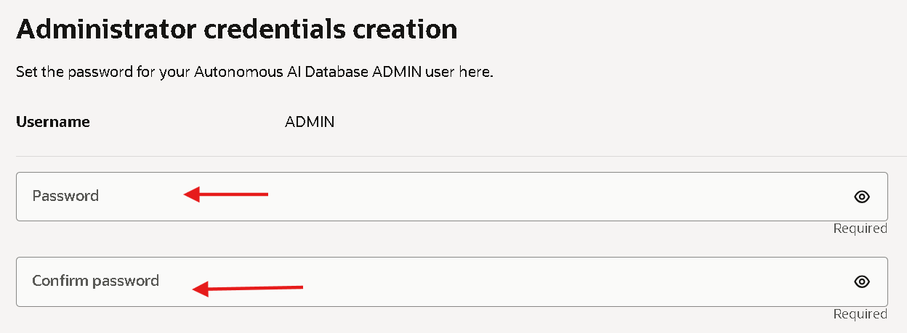
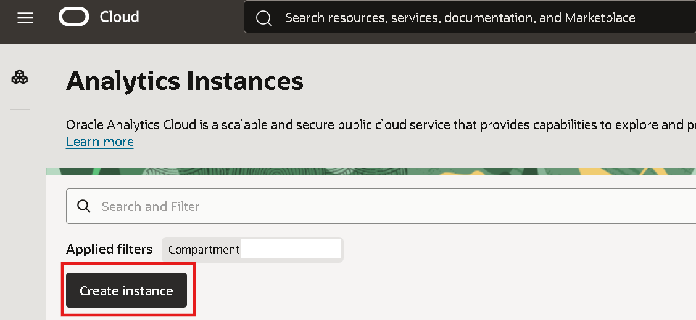
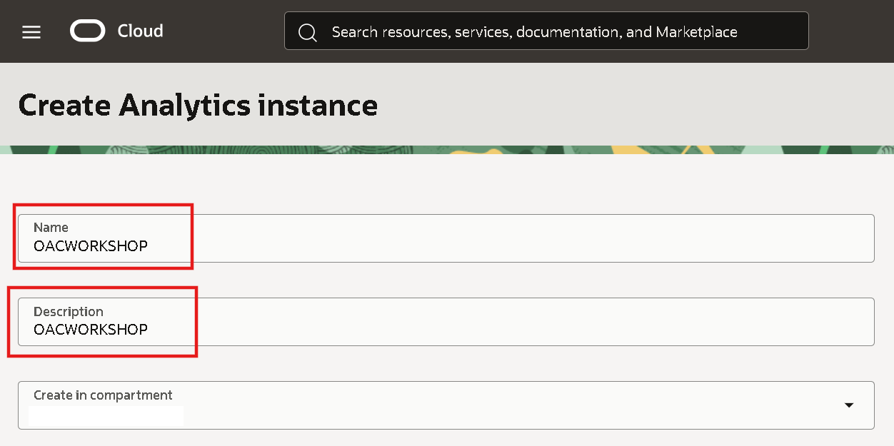
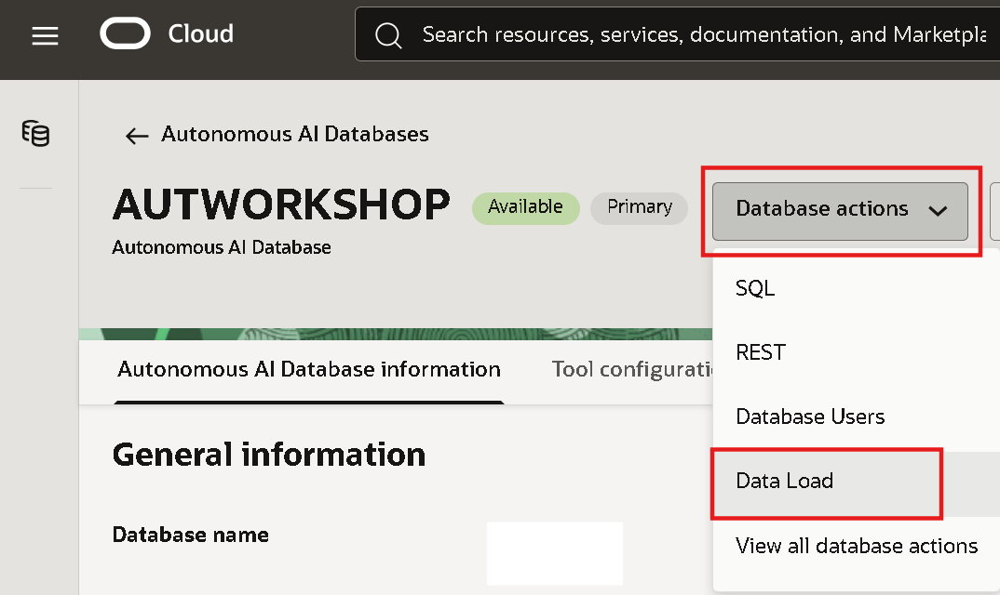
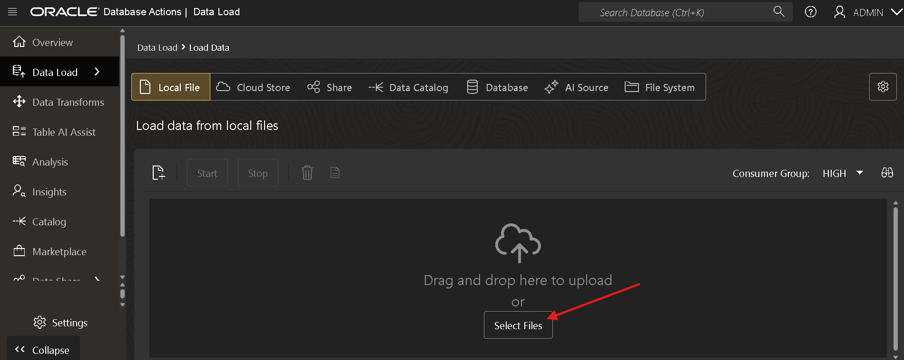
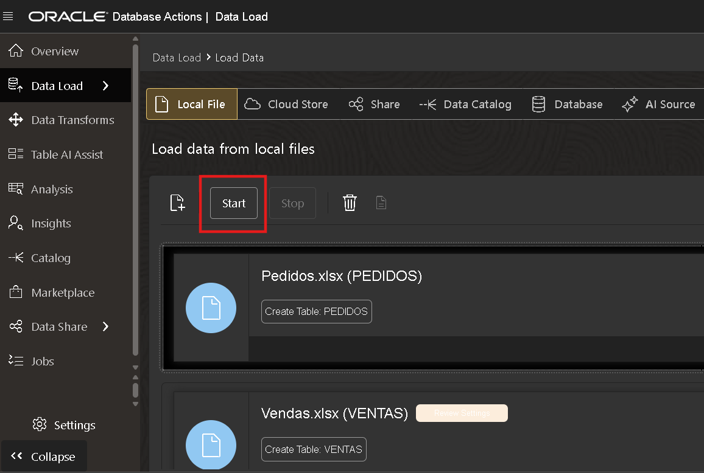
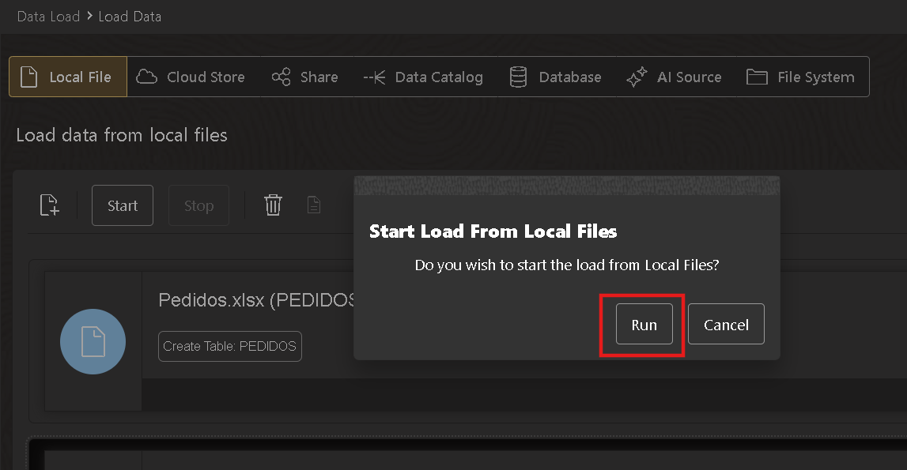

# Criar os recursos necessários para o Laboratório

## Introdução

A Oracle Cloud é a provedora de nuvem mais abrangente e integrada do setor, com opções de implantação que vão desde a nuvem pública até o seu data center. A Oracle Cloud oferece serviços de alta qualidade em Software como Serviço (SaaS), Plataforma como Serviço (PaaS) e Infraestrutura como Serviço (IaaS).
Neste laboratório, você aprenderá como provisionar um banco de dados Autonomous na Oracle Cloud Infrastructure.

***Visão geral***

A Oracle Cloud Infrastructure Autonomous Database é um ambiente de banco de dados totalmente gerenciado e pré-configurado, com três tipos de cargas de trabalho disponíveis: processamento de transações autônomo, data warehouse autônomo e JSON autônomo. Não é necessário configurar ou gerenciar nenhum hardware, nem instalar software. Após o provisionamento, você pode escalar a quantidade de núcleos de CPU ou a capacidade de armazenamento do banco de dados a qualquer momento, sem impactar a disponibilidade ou o desempenho. O banco de dados Autonomous cuida da criação do banco, bem como das seguintes tarefas de manutenção:

* Backup do banco de dados
* Aplicação de patches no banco de dados
* Atualização do banco de dados
* Ajuste do banco de dados

*Tempo estimado do laboratório:* 25 minutos

### Objetivos

Neste laboratório você irá:

* Aprender a acessar sua conta Oracle Cloud
* Provisionar um Autonomous Data Warehouse da Oracle
* Provisionar uma instância Oracle Analytics Cloud

## Tarefa 1: Faça login na Oracle Cloud

1. Abra seu navegador web e acesse [Oracle Cloud](https://cloud.oracle.com).

Insira o nome da sua conta na nuvem se for acessar uma conta com Identity Cloud Service.

Quando a nova página carregar, basta clicar em **Continuar**.

2. Na página de login da **Cloud Infrastructure**, insira suas credenciais de acesso e clique em **Entrar**.

3. Pronto! Agora você está conectado à Oracle Cloud!

## Tarefa 2: Processo de criação do banco de dados Autonomous

Para iniciar o processo de criação do Banco de Dados Autonomous:

1. Clique no menu no lado esquerdo da tela principal, selecione Banco de Dados Oracle, depois "Banco de Dados Autonomous"

2. Clique em "Criar um banco de dados Autonomous" e você será direcionado para a criação do banco.

3. Complete os campos necessários para criar seu Banco de Dados Autonomous conforme mostrado abaixo:

* Nome de exibição: **Escolha um nome de exibição para seu banco**
* Nome do banco de dados: **Escolha um nome para o banco de dados**
* Escolha o tipo de carga de trabalho: para este laboratório, selecione **Data Warehouse**
* Escolha o tipo de infraestrutura: **Infraestrutura compartilhada**

* Selecione a versão do banco de dados: **19c**
* Quantidade de OCPU: **1**
* Armazenamento (TB): **1**

* Criar credenciais de administrador: **Crie uma senha para o usuário ADMIN**
* Escolha o acesso à rede: **Acesso seguro de qualquer lugar**

* Escolha a licença e edição do banco de dados Oracle: **Licença incluída**
* Agora finalize a criação clicando no botão **"Criar banco de dados Autonomous"**

*Seu banco de dados Autonomous foi provisionado com sucesso!*

## Tarefa 3: Processo de criação do Oracle Analytics Cloud

Neste tutorial, criaremos uma instância da ferramenta Oracle Analytics Cloud.

1. Criar a OAC

- Clique no menu hamburguer no canto superior esquerdo;
- Clique em **Análise e IA**;
- Clique em **Analytics Cloud**.

- Verifique se está no compartimento correto;
- Clique em **Criar instância**.

2. Complete as informações:

* Nome: nome dado à instância;
* Descrição: descrição dada à instância – opcional;
* Criar no Compartimento: Compartimento onde a instância será criada;
* Conjunto de recursos: escolha **Edição Profissional**;
* Capacidade: escolha **OCPU** e digite **1**;
* Tipo de licença: Escolha **Licença incluída**;
- Clique em **Criar**.

3. Acesse o Oracle Analytics Cloud

Neste passo mostraremos como acessar a instância do Oracle Analytics Cloud.

- Clique no nome da instância criada "Nome escolhido";

- Clique em **Página inicial do Analytics**.

## Tarefa 4: Carregamento dos dados do laboratório no Autonomous

Para o desenvolvimento do laboratório é necessário baixar os 2 arquivos clicando aqui.
(Pedidos [aqui](https://objectstorage.us-ashburn-1.oraclecloud.com/p/U8tA6PQvsaL8jSlP9NlWMnkzWsQ29-bs8q6rEjwo0cY_-7w0nd9DOqWf94fsok4g/n/idy4hyfbs31o/b/Bucket-Fast-Track/o/Pedidos.xlsx))

(Vendas [aqui](https://objectstorage.us-ashburn-1.oraclecloud.com/p/n_Jkw7RfTdkvE45pVR9bS2FT2_spcZnmZwOZWE0gIa2VgBvjHjM22k1YIlfpnRTZ/n/idy4hyfbs31o/b/Bucket-Fast-Track/o/Ventas.xlsx))

1. Acesse seu Banco de Dados Autonomous e clique no botão **Database actions**.

2. Selecione as opções **Load Data** e **Local File**, clique em continuar.

3. Clique em **Select Files** e selecione os arquivos baixados anteriormente.

4. Para finalizar o processo de upload, clique em **start**.

5. Confirme o upload clicando em **run**.

6. Os arquivos já estarão disponíveis no banco de dados Autonomous.

## Conclusão

Nesta sessão, você provisionou o Oracle Autonomous Data Warehouse e o Oracle Analytics Cloud, que serão utilizados ao longo do laboratório. Os dados também foram carregados para alimentar as tabelas no banco de dados.

## Autoria

- **Autores** - Thais Henrique, Isabela Alvarez, Breno Comin, Isabelle Dias e Guilherme Galhardo
- **Tradução** - Eliana Romero
- **Última atualização por/data** - Eliana Romero, Agosto/2023