# Criar os recursos necessários para o Laboratório

## Introdução

A Oracle Cloud é a provedora de nuvem mais abrangente e integrada do setor, com opções de implantação que vão desde a nuvem pública até o seu data center. A Oracle Cloud oferece serviços de alta qualidade em Software como Serviço (SaaS), Plataforma como Serviço (PaaS) e Infraestrutura como Serviço (IaaS).
Neste laboratório, você aprenderá como provisionar um banco de dados Autonomous na Oracle Cloud Infrastructure.

***Visão geral***

A Oracle Cloud Infrastructure Autonomous Database é um ambiente de banco de dados totalmente gerenciado e pré-configurado, com três tipos de cargas de trabalho disponíveis: processamento de transações autônomo, data warehouse autônomo e JSON autônomo. Não é necessário configurar ou gerenciar nenhum hardware, nem instalar software. Após o provisionamento, você pode escalar a quantidade de núcleos de CPU ou a capacidade de armazenamento do banco de dados a qualquer momento, sem impactar a disponibilidade ou o desempenho. O banco de dados Autonomous cuida da criação do banco, bem como das seguintes tarefas de manutenção:

* Backup do banco de dados
* Aplicação de patches no banco de dados
* Atualização do banco de dados
* Ajuste do banco de dados

*Tempo estimado do laboratório:* 30 minutos

### Objetivos

Neste laboratório você irá:

* Aprender a acessar sua conta Oracle Cloud
* Provisionar um Autonomous Data Warehouse da Oracle
* Provisionar uma instância Oracle Analytics Cloud

## Tarefa 1: Faça login na Oracle Cloud

1. Abra seu navegador web e acesse [Oracle Cloud](https://cloud.oracle.com).

Insira o nome da sua conta na nuvem se for acessar uma conta com Identity Cloud Service.

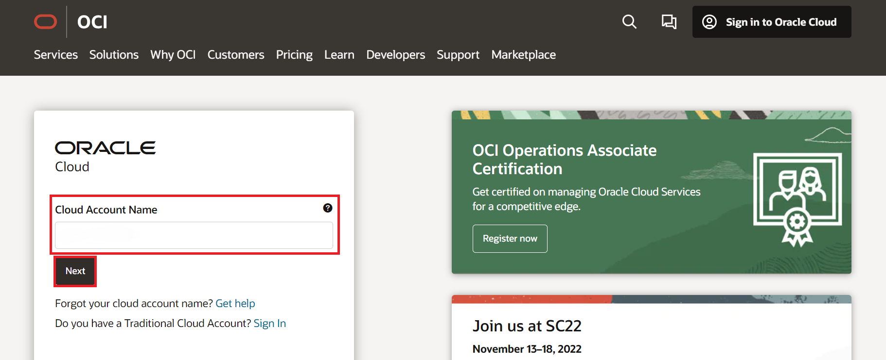

Quando a nova página carregar, basta clicar em **Continuar**.

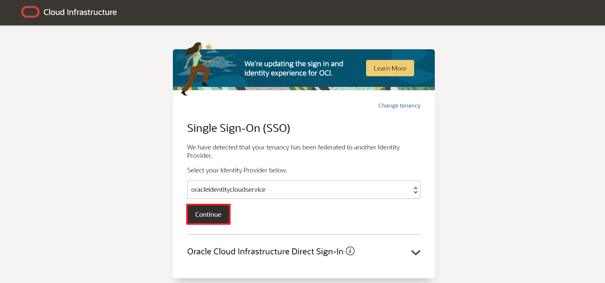

2. Na página de login da **Cloud Infrastructure**, insira suas credenciais de acesso e clique em **Entrar**.

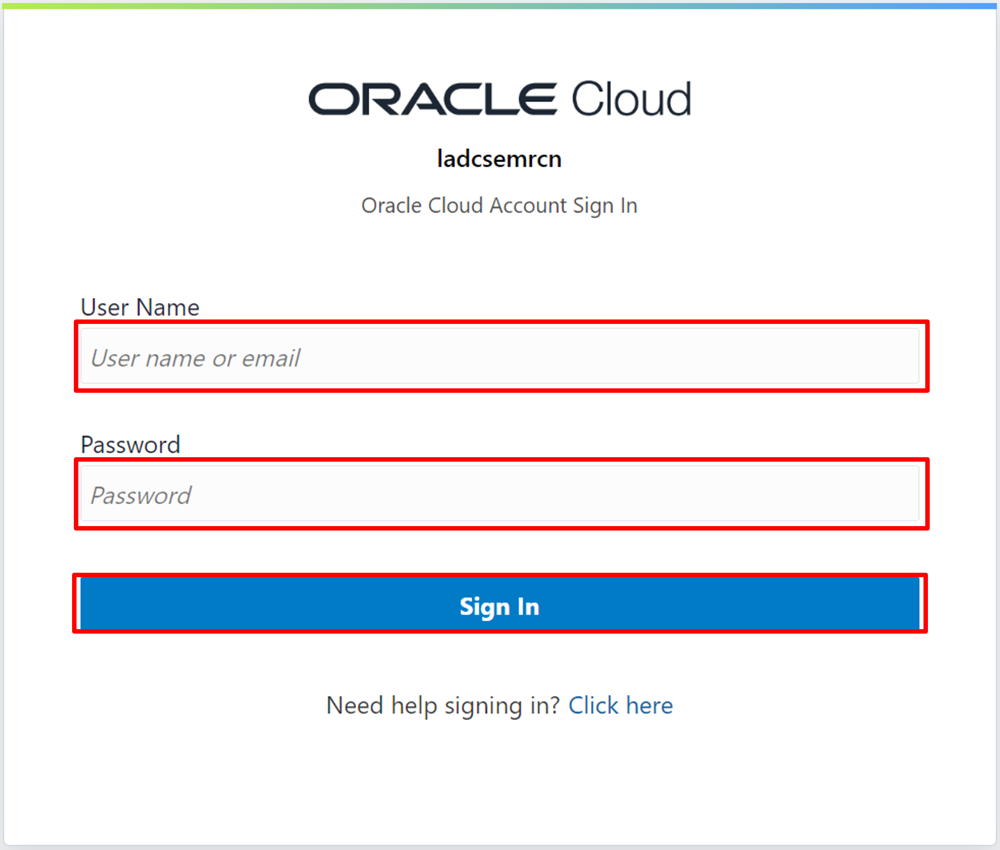

3. Pronto! Agora você está conectado à Oracle Cloud!

## Tarefa 2: Processo de criação do banco de dados Autonomous

Para iniciar o processo de criação do Banco de Dados Autonomous:

1. Clique no menu (☰) e selecione **Oracle AI Database ⮕ Autonomous AI Database**

2. Clique em **Create Autonomous AI Database** e você será direcionado para a criação do banco.

3. Complete os campos necessários para criar seu Banco de Dados Autonomous conforme mostrado abaixo:

* Nome de exibição: **Escolha um nome de exibição para seu banco**. Sugestão: AUTWORKSHOP
* Nome do banco de dados: **Escolha um nome para o banco de dados**. Sugestão: AUTWORKSHOP
* Selecione o Compartment com nome de **NomeTenancy (root)**

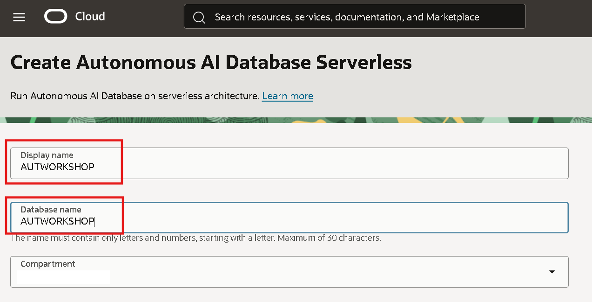

* Escolha o workload type: **Lakehouse**

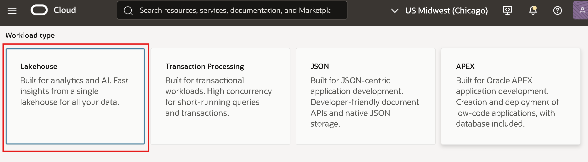

* Selecione a versão do banco de dados: **26ai**
* Quantidade de ECPU: **2**
* Compute Auto Scaling: **Desativado**

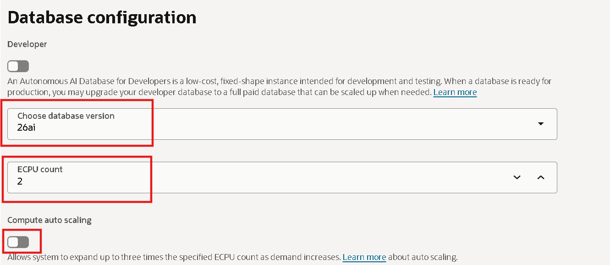

* Storage: **1** TB

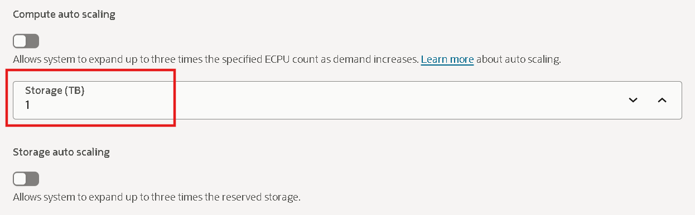

* Criar credenciais do administrador: **Crie uma senha para o usuário ADMIN**. Senha recomendada: **WORKSHOPsec2026##**

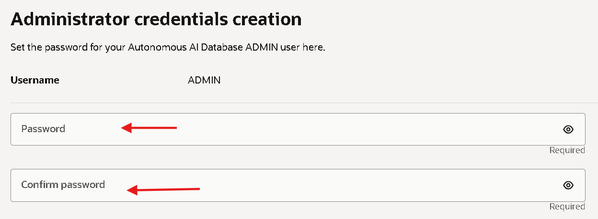

* Escolha o acesso à rede: **Secure access from everywhere**

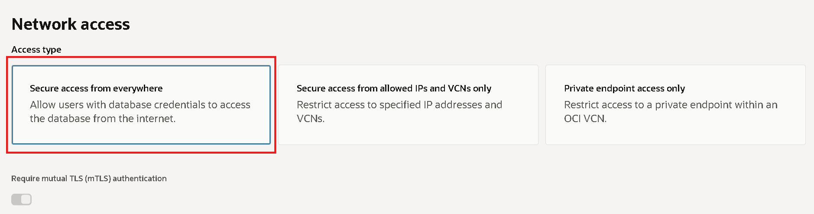

* Agora finalize a criação clicando no botão **Create**

*Seu banco de dados Autonomous foi provisionado com sucesso!*

## Tarefa 3: Processo de criação do Oracle Analytics Cloud

Neste tutorial, criaremos uma instância da ferramenta Oracle Analytics Cloud.

1. Clique no menu (☰) e selecione **Analytics & AI ⮕ Analytics Cloud**

Clique em **Create instance**:

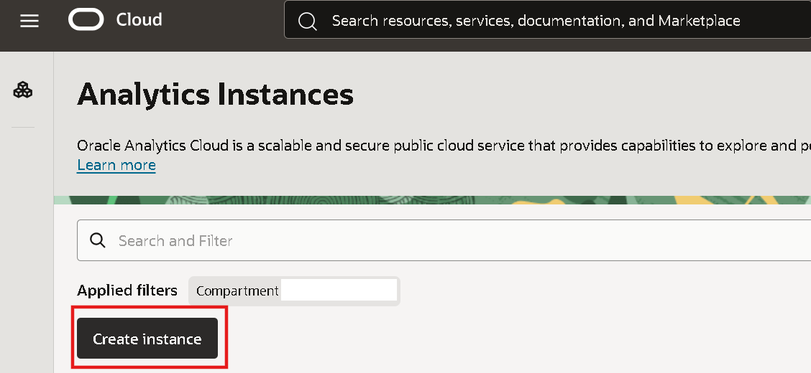

2. Complete as informações:

* Nome: nome dado à instância. Sugestão: **OACWORKSHOP**
* Descrição: descrição dada à instância – **opcional**;
* Selecione o Compartment com nome de **NomeTenancy (root)**

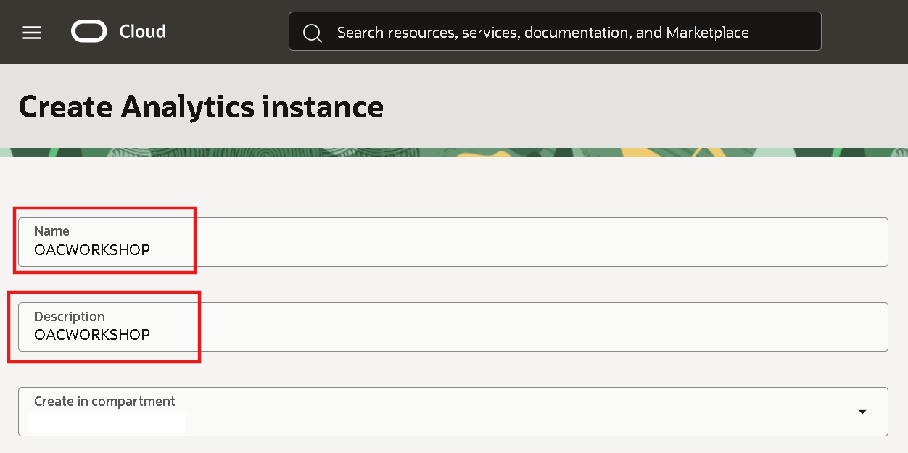

* Capacity type: escolha **OCPU** e quantidade OCPU **1**;

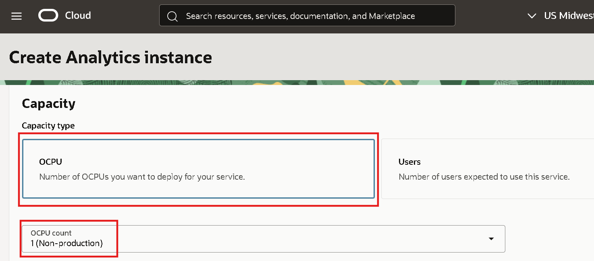

* License: escolha **License included**;
* Edition: escolha **Enterprise edition**;

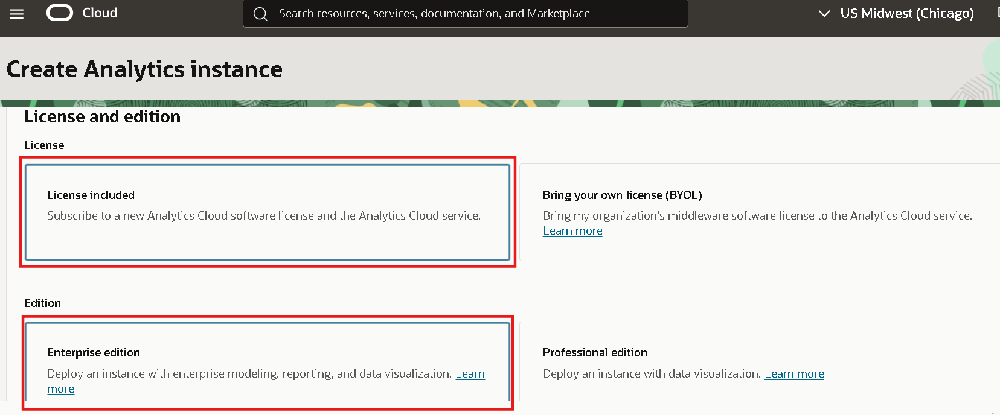

* Software updates: **Regular**

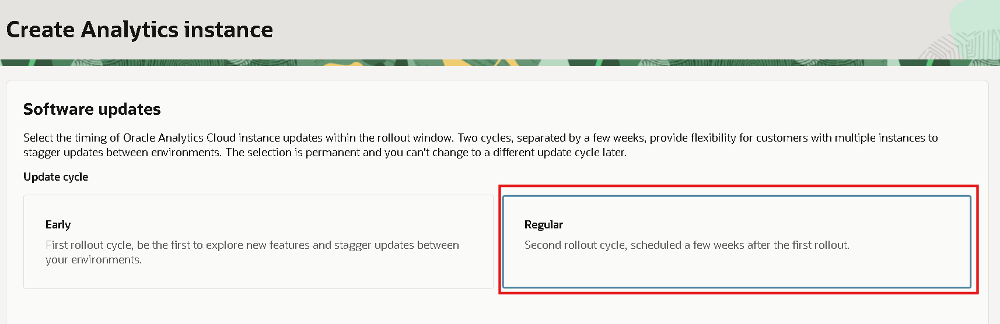

* Agora finalize a criação clicando no botão **Create**

*Seu Oracle Analytics Cloud está sendo provisionado com sucesso!*

## Tarefa 4: Carregando os dados do laboratório no Autonomous

1. Para o desenvolvimento do laboratório é necessário baixar esse script para criação das tabelas e dados de exemplo.

[Baixar Script](./script/script-dados.sql)

1. Acesse o banco de dados, clique no menu (☰) e selecione **Oracle AI Database ⮕ Autonomous AI Database**

Clique em cima do nome do banco de dados definido anteriormente:

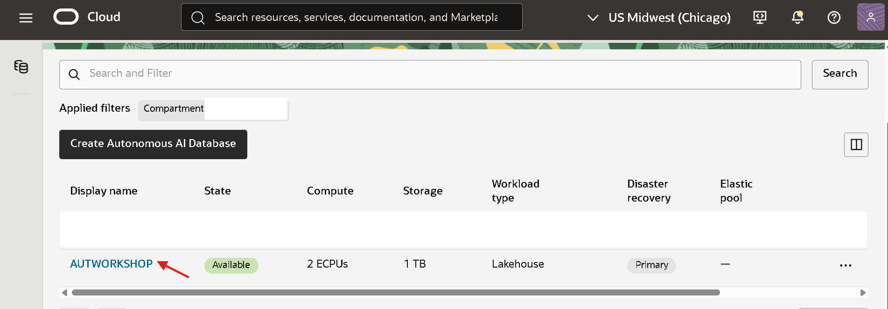

2. Clique no botão **Database actions ⮕ SQL**.

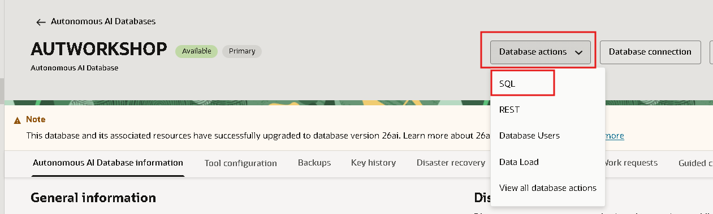

3. Copie e cole o script sql baixado anteriormente. Selecione todo o script (ctrl + a) e clique em **Run as SQL script**, conforme ilustrado na imagem.

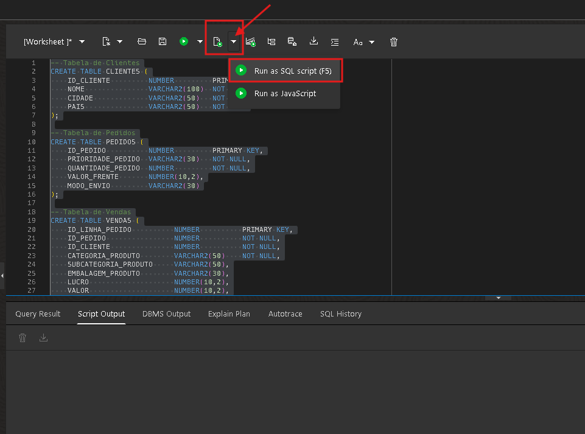

6. Para verificar se os dados foram criados, execute os seguintes comandos e clique no botão de play para executar o comando:

    <copy>
SELECT * FROM PEDIDOS;
    </copy>
<!-- Separador -->

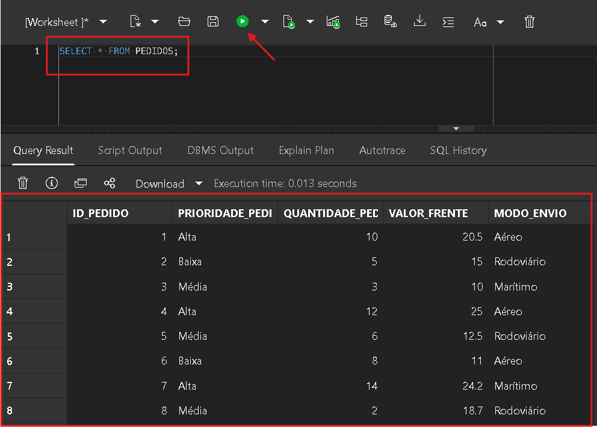

Repita esse mesmo processo para as tabelas de **VENDAS** e **CLIENTES**:

    <copy>
SELECT * FROM VENDAS;
    </copy>
<!-- Separador -->

    <copy>
SELECT * FROM CLIENTES;
    </copy>
<!-- Separador -->

*Seus dados de exemplos já estão prontos com sucesso!*

## Conclusão

Nesta sessão, você provisionou o Oracle Autonomous AI Database e o Oracle Analytics Cloud, que serão utilizados ao longo do laboratório. Além disso, fizemos a ingestão dos dados que serão necessários.

## Autoria

- **Autores** - Victória Rodrigues
- **Última atualização** - Fevereiro/2026