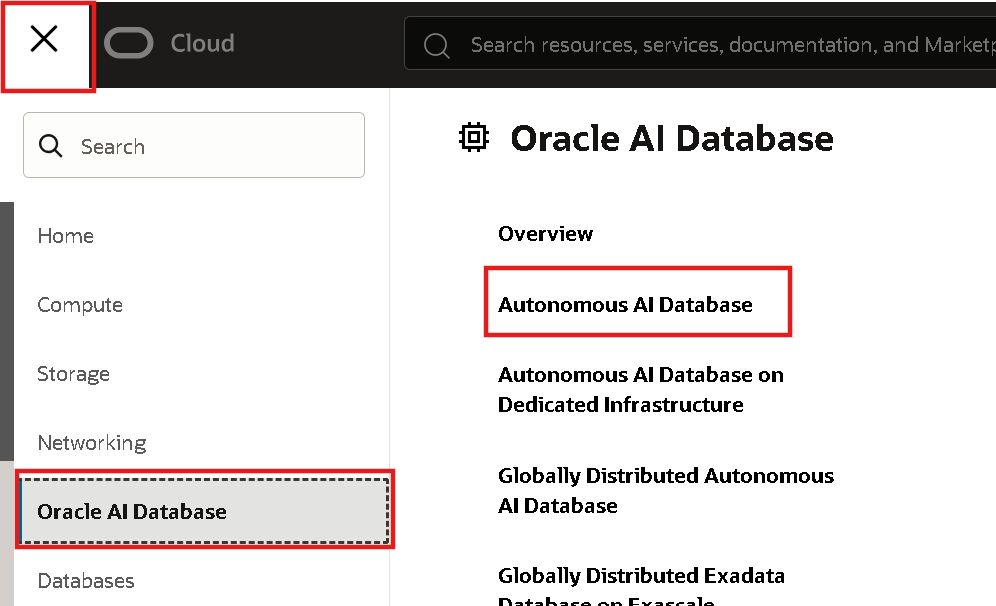
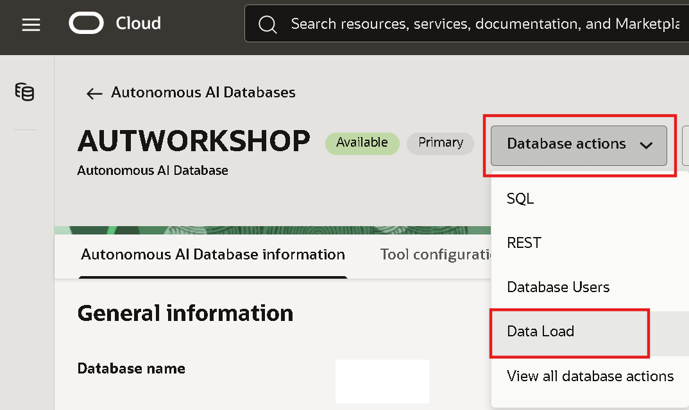
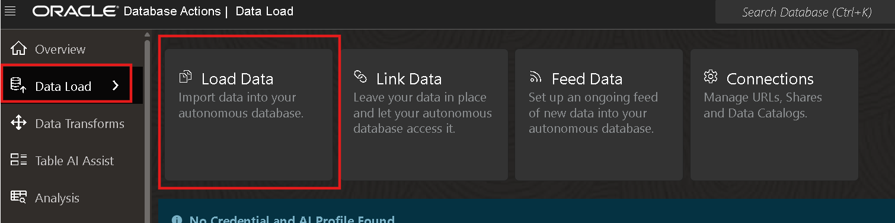
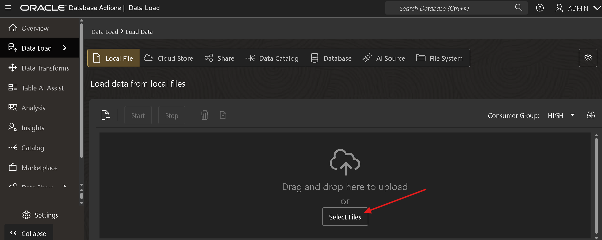
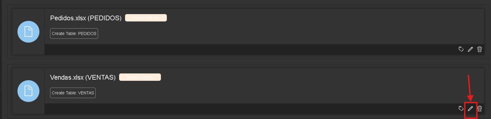
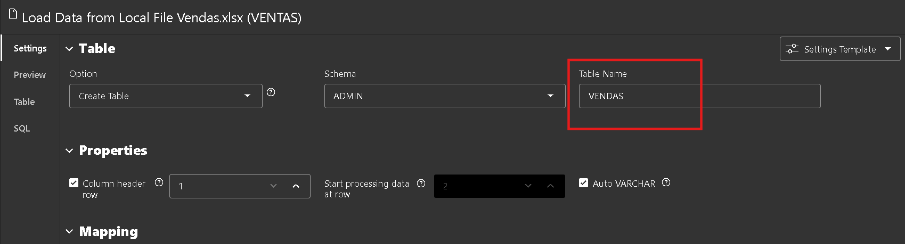
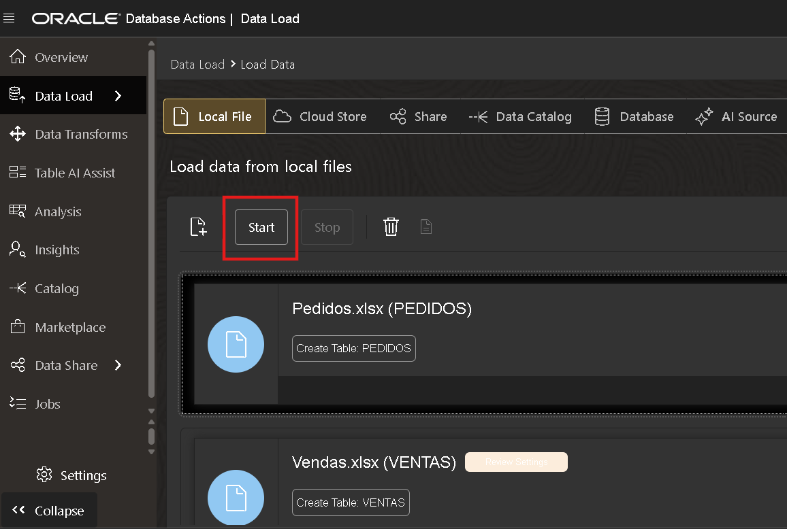
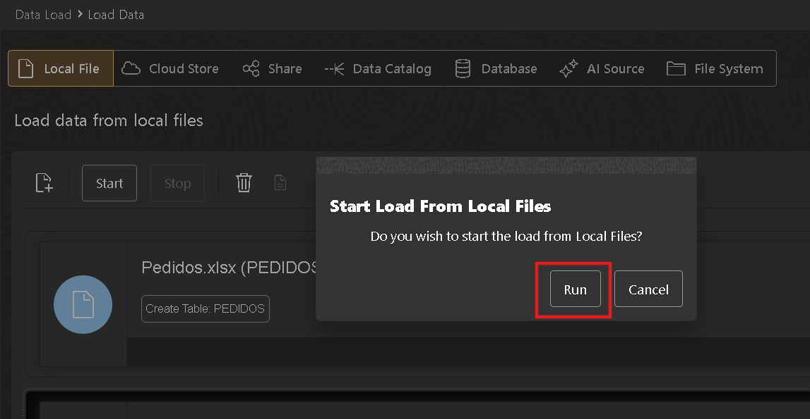
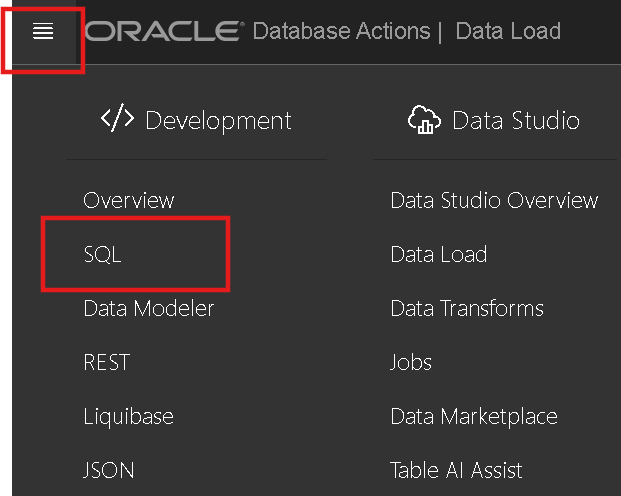
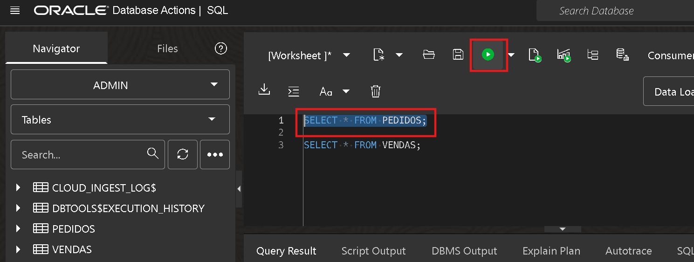

# Criar os recursos necessários para o Laboratório

## Introdução

A Oracle Cloud é a provedora de nuvem mais abrangente e integrada do setor, com opções de implantação que vão desde a nuvem pública até o seu data center. A Oracle Cloud oferece serviços de alta qualidade em Software como Serviço (SaaS), Plataforma como Serviço (PaaS) e Infraestrutura como Serviço (IaaS).
Neste laboratório, você aprenderá como provisionar um banco de dados Autonomous na Oracle Cloud Infrastructure.

***Visão geral***

A Oracle Cloud Infrastructure Autonomous Database é um ambiente de banco de dados totalmente gerenciado e pré-configurado, com três tipos de cargas de trabalho disponíveis: processamento de transações autônomo, data warehouse autônomo e JSON autônomo. Não é necessário configurar ou gerenciar nenhum hardware, nem instalar software. Após o provisionamento, você pode escalar a quantidade de núcleos de CPU ou a capacidade de armazenamento do banco de dados a qualquer momento, sem impactar a disponibilidade ou o desempenho. O banco de dados Autonomous cuida da criação do banco, bem como das seguintes tarefas de manutenção:

* Backup do banco de dados
* Aplicação de patches no banco de dados
* Atualização do banco de dados
* Ajuste do banco de dados

*Tempo estimado do laboratório:* 25 minutos

### Objetivos

Neste laboratório você irá:

* Aprender a acessar sua conta Oracle Cloud
* Provisionar um Autonomous Data Warehouse da Oracle
* Provisionar uma instância Oracle Analytics Cloud

## Tarefa 1: Download dos arquivos

Para o desenvolvimento do laboratório é necessário baixar os 2 arquivos.

* (Pedidos [Download-Pedidos](https://objectstorage.us-ashburn-1.oraclecloud.com/p/U8tA6PQvsaL8jSlP9NlWMnkzWsQ29-bs8q6rEjwo0cY_-7w0nd9DOqWf94fsok4g/n/idy4hyfbs31o/b/Bucket-Fast-Track/o/Pedidos.xlsx))

* (Vendas [Download-Vendas](https://objectstorage.us-ashburn-1.oraclecloud.com/p/n_Jkw7RfTdkvE45pVR9bS2FT2_spcZnmZwOZWE0gIa2VgBvjHjM22k1YIlfpnRTZ/n/idy4hyfbs31o/b/Bucket-Fast-Track/o/Ventas.xlsx))

## Tarefa 2: Acessar o banco de dados Autonomous e Carregamento dos dados

1. Clique no menu (☰) e selecione **Oracle AI Database ⮕ Autonomous AI Database**

Clique em cima do nome do banco de dados definido anteriormente:

2. Clique no botão **Database actions ⮕ Data Load**.

3. Selecione a opção **Data Load**.

3. Clique em **Select Files** e selecione os arquivos baixados anteriormente.

Clique no icone de lápis para editar:

Altere o nome da tabela para VENDAS:

Clique no botão **Close** para finalizar as alterações.

4. Clique em **start**.

5. Confirme clicando em **Run**.

6. Verificar os dados carregados no banco de dados Autonomous. Clique no menu (☰) e selecione **SQL**

Execute o comando select:

<copy>
SELECT * FROM PEDIDOS;
</copy>

Execute o comando select:

<copy>
SELECT * FROM VENDAS;
</copy>

## Conclusão

Nesta sessão, você aprendemos como fazer a ingestão de dados no Autonomous utilizando o Data Load.

## Autoria

- **Autores** - Victória Rodrigues
- **Última atualização por/data** - Fevereiro/2026