# Primeiros passos no OAC

## Introdução

Neste Lab você vai aprender a navegar pela interface do Oracle Analytics Cloud.

***Overview***

O Oracle Analytics Cloud é um serviço de nuvem pública escalável e seguro que fornece um conjunto completo de recursos para explorar e executar análises colaborativas para você, seu grupo de trabalho e sua empresa. Com o Oracle Analytics Cloud, você também tem recursos flexíveis de gerenciamento de serviços, incluindo configuração rápida, dimensionamento e patches fáceis. Como usuário do Oracle Analytics com acesso de Autor de Conteúdo do DV, você poderá estabelecer conexão com as origens de dados usadas por sua organização. Por exemplo, você pode criar um conjunto de dados que inclua tabelas de uma conexão do Autonomous, tabelas de uma conexão Spark e tabelas de uma área de assunto local.

*Tempo estimado para o Lab:* 10 Minutos

### Objetivos

Neste Laboratório você vai:

* Explorar os recursos disponíveis de forma nativa dentro do OAC (Oracle Analytics Cloud)

## Tarefa 1: Acessar a instância do Oracle Analytics Cloud

1. Clique no menu (☰) e selecione **Analytics & AI ⮕ Analytics Cloud**

3. Clique em cima do nome do Analytics Cloud provisionado anteriormente.

4. Agora clique no botão **Analytics Home Page**. Logo, depois faça login novamente na sua conta da OCI.

Você será direcionado para a Página Inicial do OAC.

##  Tarefa 2: Página Inicial

Toda navegação é feita pelo Menu no lado superior esquerdo da tela principal.

1. Clicar no Menu no lado superior esquerdo da tela principal e em **Catalog**.

Em **My Folders** (minhas pastas) podemos criar pasta e adicionar nossos projetos pessoais e somente pode ser acessadas ​​pelo usuário que criou e salvou o conteúdo na pasta. Clique em **My Folders** e no icone da pasta, conforme a imagem abaixo:

Defina um nome para sua pasta e clique em Create.

Caso você queira compartilhar seus projeto com outras pessoas ou grupos, é necessário mover ou criar no diretório **Shared Folders**. Clique em **Shared Folders** e no icone da pasta, conforme a imagem abaixo:

Defina um nome para sua pasta e clique em Create.

Clique nos três pontilhos e Inspect:

Clique em **Access**. Nesse local podemos definir as pessoas ou grupos que tem permissão de visualizar/editar o conteúdo da pasta. Como podemos observa já temos dois grupos já adicionados.

Para adicionar novos usuarios ou grupos, utilize a barra de pesquisa no canto superior direito. Exemplo de grupo padrão do OAC: **DV Consumer**

Agora visualizamos o grupo adicionado com permissão de leitura e escrita:

Caso queira remover o grupo ou usuário da pasta, passe o mouse em cima do item, será mostrado um item de lixeira:

Clique em **Save ⮕ Apply ⮕ Close**:

3. Clicar no Menu no lado superior esquerdo da tela principal e em **Data** (Dados). Em **Datasets**, ficaram disponiveis todos os conjuntos de dados criados para serem utilizados em diferentes projetos. O OAC já disponibiliza dois dataset de exemplo.

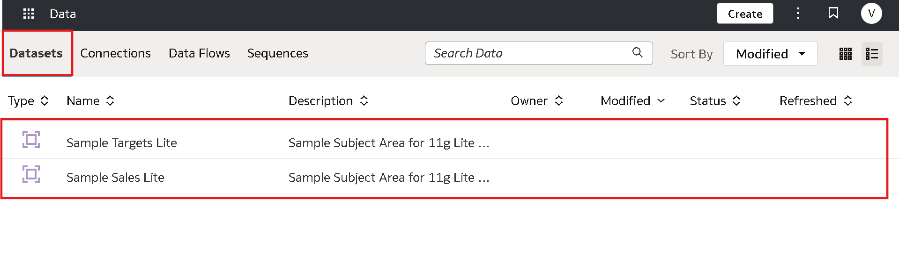

Ainda nesta aba, siga para a opção  **Connections**, aqui é possivel visualizar todas as conexões criadas por você ou coneções concedidas para consumir dados externos, como por exemplo bancos de dados. 

Ainda nesta aba, siga para a opção  **Data Flow**, que permite que você organize e integre seus dados para produzir conjuntos de dados que seus usuários podem visualizar.

Por exemplo, você pode usar um fluxo de dados para:

* Criar um conjunto de dados.
* Combinar dados de diferentes fontes.
* Treinar modelos de aprendizado de máquina ou aplicar um modelo de aprendizado de máquina aos seus dados.

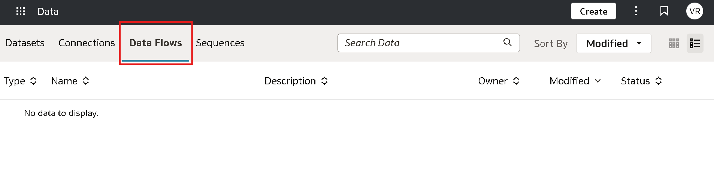

Seguindo, teremos **Sequences**. Uma sequência é definida como uma coleção de Data Flow que você executa juntos. Eles são úteis quando você quiser executar vários fluxos de dados como uma única transação.

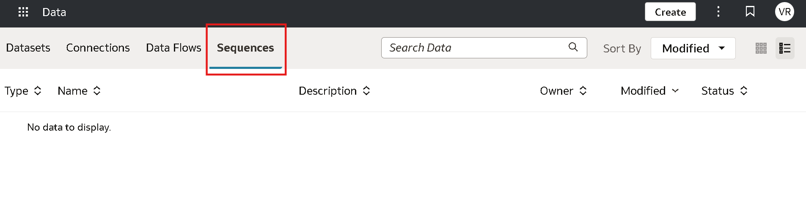

4. O Oracle Analytics permite que você registre e use modelos de machine leaning da Oracle, provenientes do Oracle Database ou do Oracle Autonomous AI Lakehouse, clique em 
**Machine Learning** para acessar uma lista de modelos e scripts registrados:

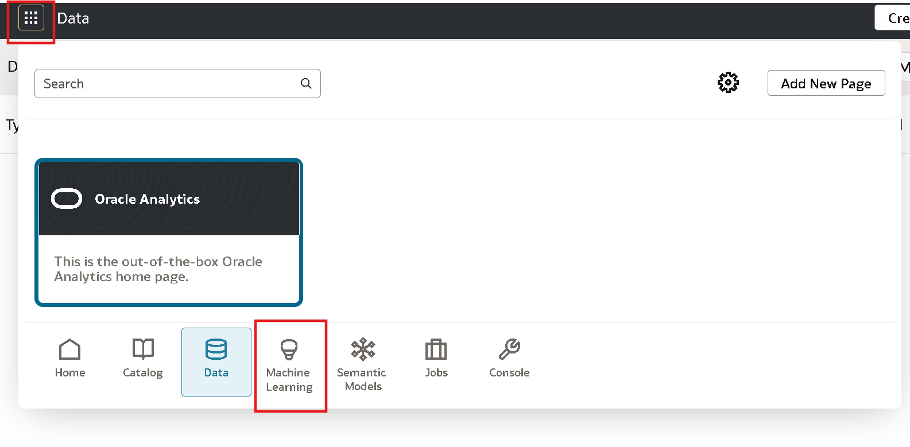

5. Clicar no Menu no lado superior esquerdo da tela principal e em **Semantic Models** (modelo semântico). Um modelo semântico é um modelo de metadados que contém objetos físicos de banco de dados que são abstraídos e modificados em dimensões lógicas. Um modelo semântico permite estruturar dados de uma forma que seja amigável para os negócios. Ele possibilita adicionar semântica de negócios para dar significado aos dados e às regras de governança que protegem o acesso aos dados.

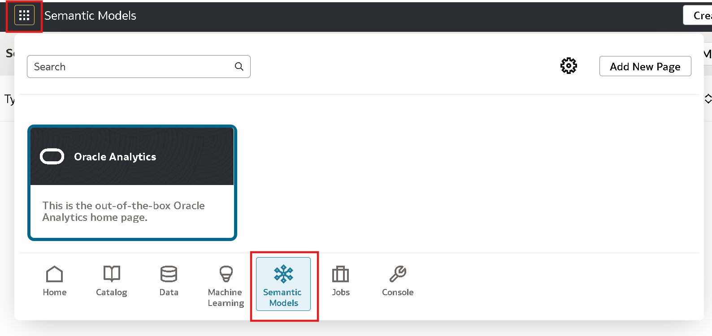

6. Para rastrear o status de seus jobs e gerenciá-los, clicar no menu no lado superior esquerdo da tela principal e em **Jobs** . Você pode monitorar o número de jobs filtrando por Tipo de Objeto e o Status do mesmo.

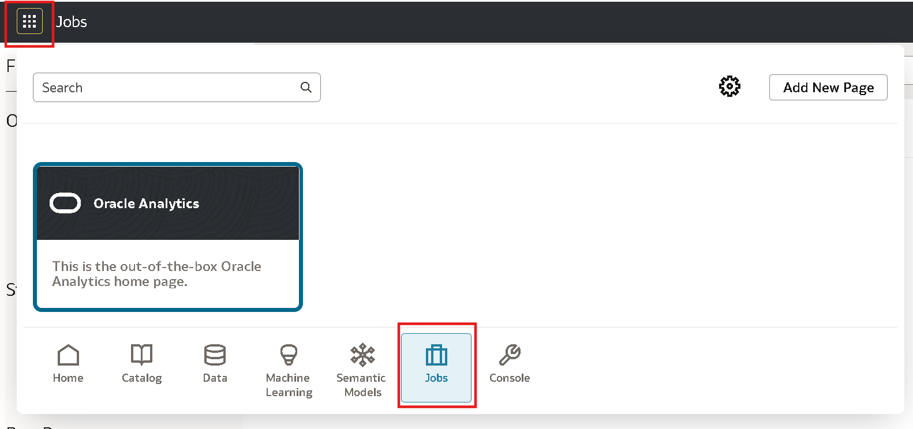

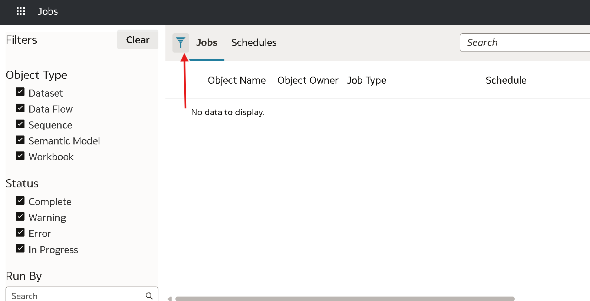

7. Clicar no Menu no lado superior esquerdo da tela principal e em **Console**, você encontrará opções para gerenciar permissões de usuário, configurar vários aspectos do Oracle Analytics Cloud e executar outras tarefas administrativas.

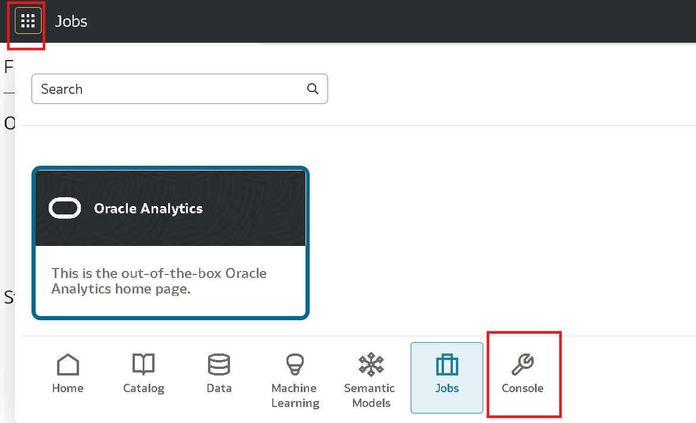

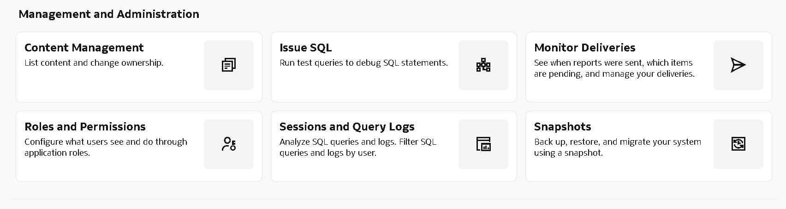

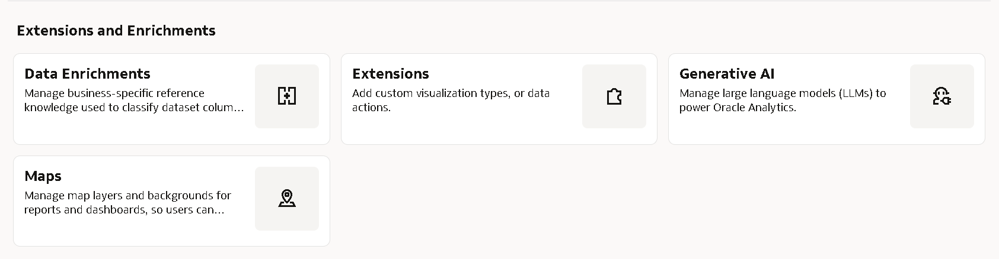

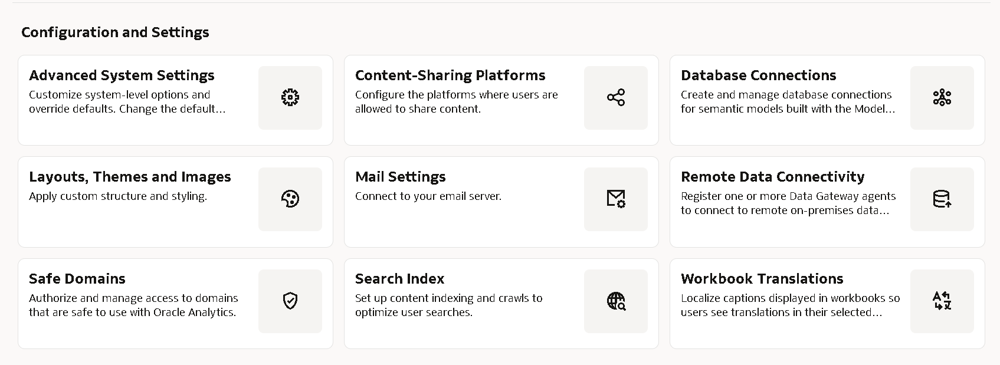

## Autoria

- **Autores** - Victória Rodrigues
- **Última atualização** - Fevereiro/2026