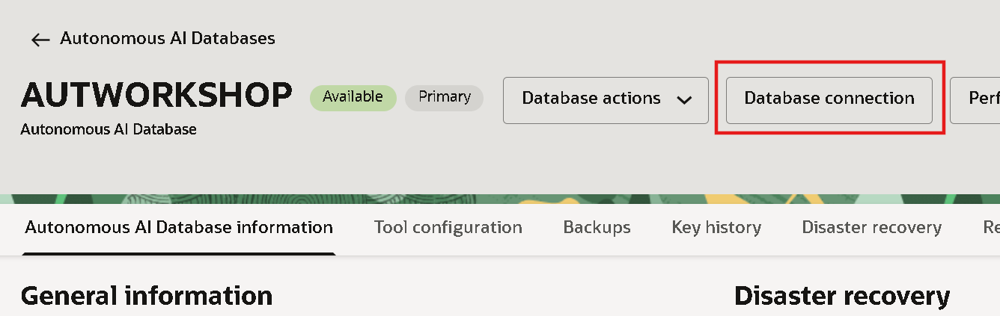
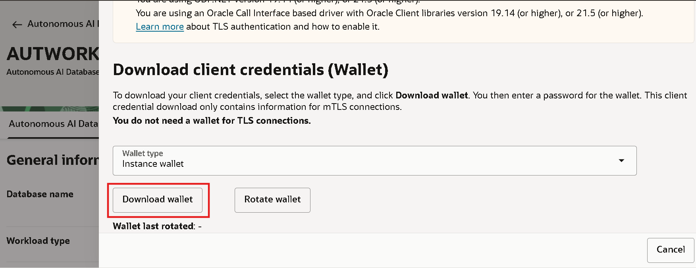
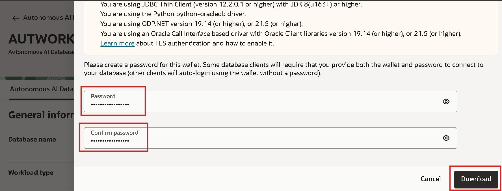
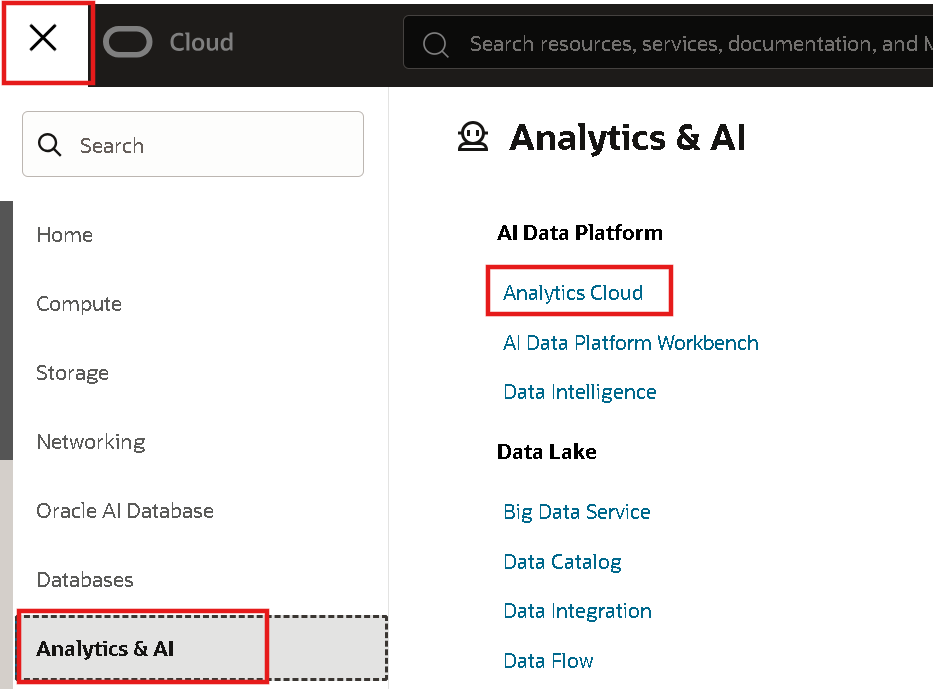
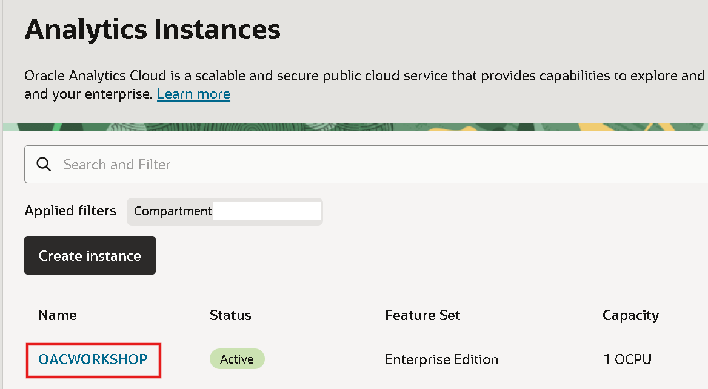
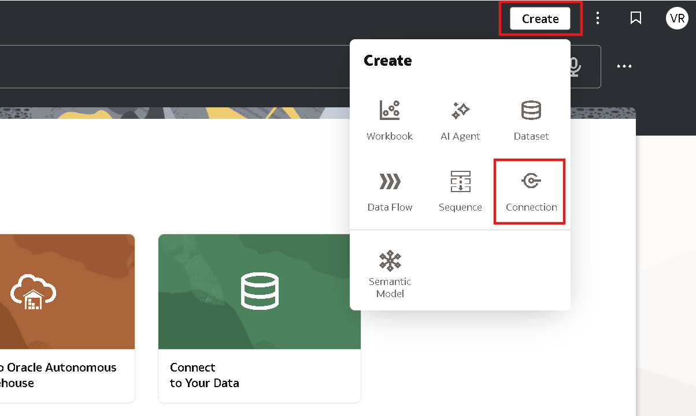
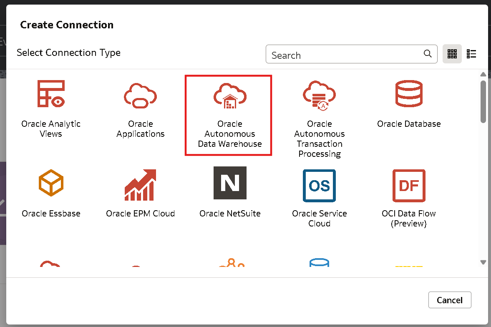
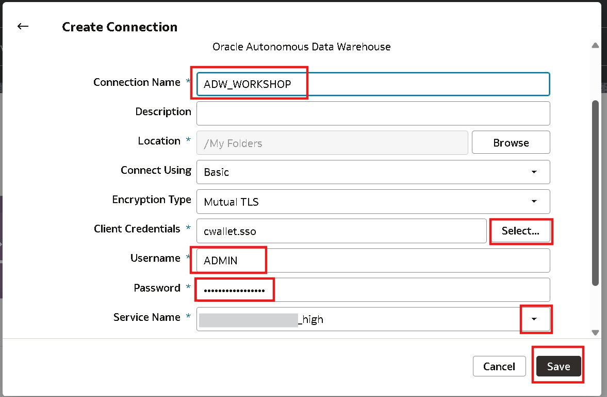
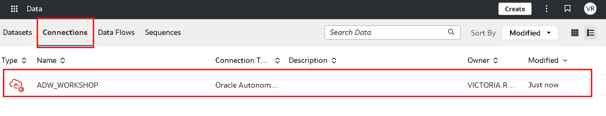

# Conexão no OAC

## Introdução

Neste Lab você vai aprender como criar uma conexão dos seus dados do Autonomous com Oracle Analytics Cloud.

***Overview***

Você pode se conectar a diversos tipos de fontes de dados, como bancos de dados na nuvem, bancos de dados locais e muitos aplicativos de uso comum, como Dropbox, Google Drive e Amazon Hive.

Você cria uma conexão para cada fonte de dados que deseja acessar no Oracle Analytics. Uma vez conectado, você pode visualizar seus dados para gerar insights.

*Tempo estimado para o Lab:* 10 Minutos

### Objetivos

* Conectar a fonte de dados do Autonomous no OAC

## Tarefa 1: Acessar o banco de dados Autonomous e Download Wallet

1. Clique no menu (☰) e selecione **Oracle AI Database ⮕ Autonomous AI Database**

Clique em cima do nome do banco de dados definido anteriormente:

Clique em **Database connection ⮕ Download wallet**

Defina uma senha para a wallet e clique em Download. Sugestão de senha:WORKSHOPsec2026##

Salve a wallet no seu computador, iremos utiliza-lá na próxima etapa.

## Tarefa 2: Criando conexão do Autonomous com Analytics

1. Clique no menu (☰) e selecione **Analytics & AI ⮕ Analytics Cloud**

3. Clique em cima do nome do Analytics Cloud provisionado anteriormente.

4. Agora clique no botão **Analytics Home Page**. Logo, depois faça login novamente na sua conta da OCI.

Após acessar a página inicial do OAC, clique em **Create ⮕ Connection**, conforme apresentado na imagem abaixo:

Aqui é possível visualizar todos os tipos de conexões que são possíveis no Oracle Analytics. Nesse laboratório iremos realizar a conexão com o **Oracle Autonomous Data Warehouse**

Para realizar a conexão será necessário preencher algumas informações, sendo elas:

* Connection name: ADW_WORKSHOP (Nome da conexão)
* Client Credentials: Selecionar o arquivo da wallet do banco que fizemos o download na tarefa 1.
* Username: ADMIN (Nome do schema)
* Password: WORKSHOPsec2026## (Senha esquema do banco de dados)
* Service Name: <nome-do-banco>_high 

Após preencher todas as informações, clique em **Save**. Para visualizar a conexão criada acesse o  **Menu ⮕ Data ⮕ Connections**

## Conclusão

Nesta sessão, aprendemos como criar uma conexão dentro do Oracle Analytics para consumir os dados do Autonomous.

## Autoria

- **Autores** - Victória Rodrigues
- **Última atualização** - Fevereiro/2026