# Criar um Conjunto de Dados

## Introdução

Neste Lab você vai aprender a criar um Conjunto de Dados (Dataset) no Oracle Analytics Cloud.

***Overview***

Conjuntos de Dados podem ser criados a partir de uma ou mais tabelas, provenientes da mesma conexão ou de conexões diferentes — incluindo arquivos CSV ou XLSX. É possível combinar todas essas tabelas utilizando o recurso de Diagrama de Junções (Join Diagram).

*Tiempo estimado de laboratorio:* 15 minutos

### Objetivos

* Selecionar as tabelas que serão utilizadas
* Fazer o Join entre as tabelas
* Salvar o Conjunto de Dados

## Tarefa 1: Localize as tabelas

1. Clique no botão **Create** na parte superior direita e em seguida selecione **Dataset**.

2. Selecione a conexão criada por você anteriormente:

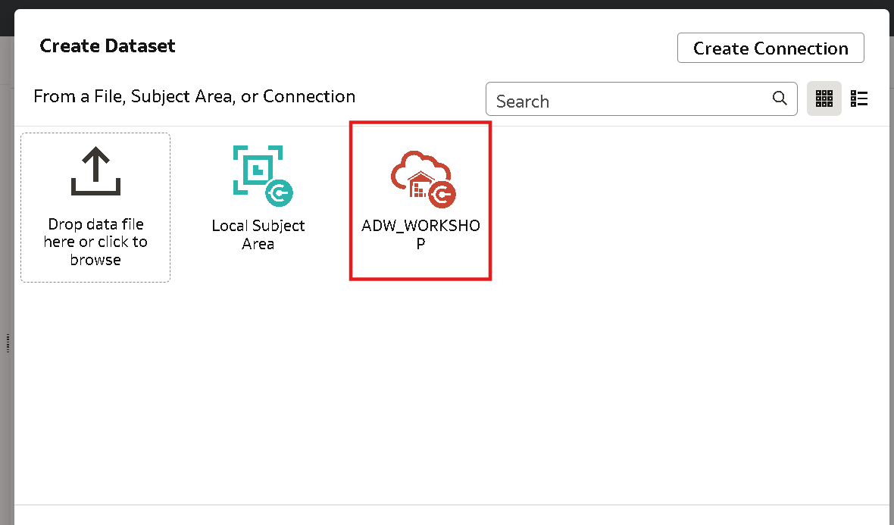

3. Expanda a lista de Esquemas do Autonomous Data Warehouse (ADW), localize o Esquema **ADMIN** e localize as duas tabelas que utilizaremos nesse Workshop: **Vendas** e **Pedidos**.

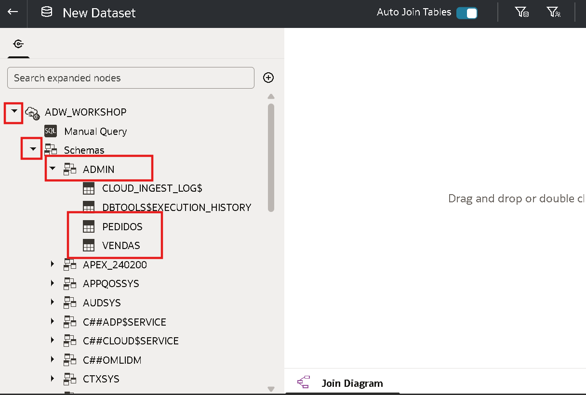

## Tarea 2: Join entre as tabelas

1. Selecione a tabela **Pedidos** e arraste até o centro da tela ne aba **Join Diagram**.

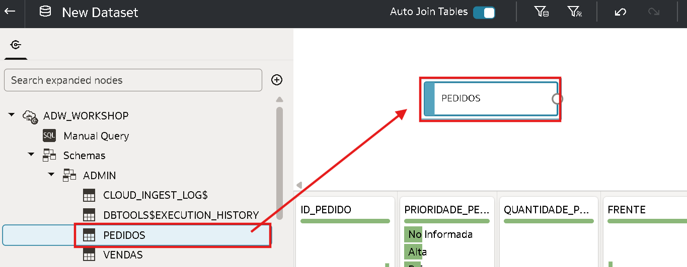

2. Em seguida arraste a tabela **Vendas** e solte ao lado da tabela de pedidos.

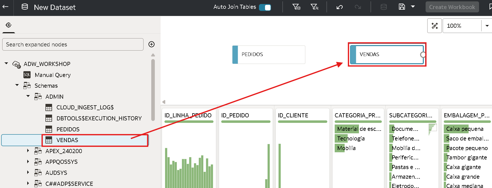

O Oracle Analytics Cloud (OAC) vai criar o Join de forma automática para você, desde que as duas tabelas tenham o mesmo nome na coluna e que as duas colunas sejam do mesmo **"Tipo"**. Escolha o **ID_PEDIDO** para junção, conforme o exemplo abaixo:

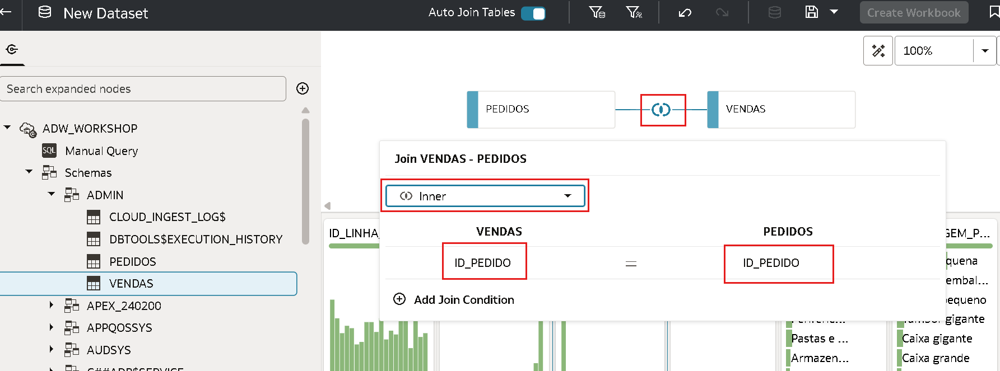

> **Nota:** Existem dois tipos de colunas no Oracle Analytics Cloud: ***Atributo*** ou ***Medida***

As colunas do tipo ***Medida*** aceitam valores numéricos e poderemos executar operações matemáticas e agregações com os dados dessa coluna.

**Exemplo: Valor da Venda, Quantidade de produtos, Lucro, Custo, Desconto etc**

As colunas do tipo ***Atributo*** aceitam qualquer tipo de dados descritivo, que não serão usados para nenhum tipo de cálculo. Podemos ter campos com texto, números, localizações, datas, entre outros.

**Exemplo: ID de produto, ID do cliente, Número da Nota Fiscal, Nome do Cliente, Idade, Endereço, Data de Venda, Cidade, País etc**

Para verificar o tipo de cada coluna, clique em cima do nome da tabela na aba inferir, na coluna deseja clique em cima do icone ao lado do nome da coluna.

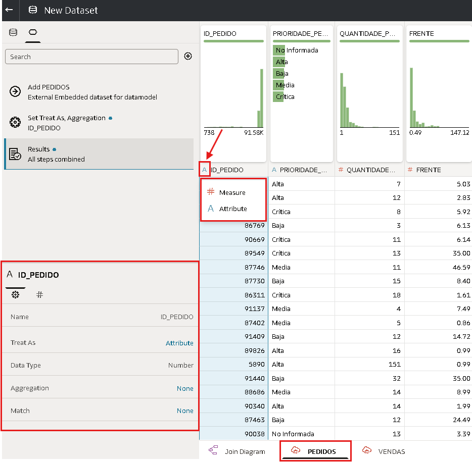

3. Clique com o botão direto do mouse na tabela **Vendas** dentro do Diagrama de Junção e selecione a opção **Preserve Grain**.

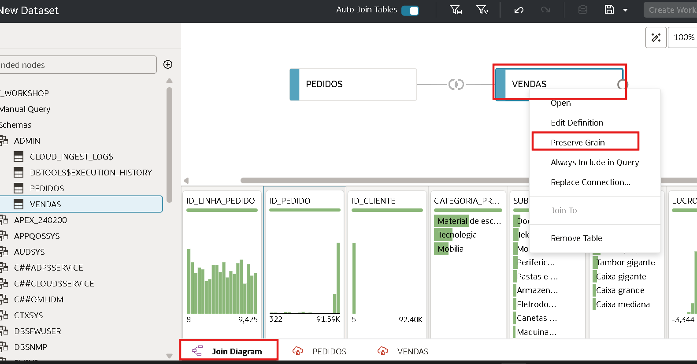

4. Após isso você verá um simbolo de check na lateral da caixa que representa a tabela **Vendas**, indicando que a granularidade da tabela está preservada.

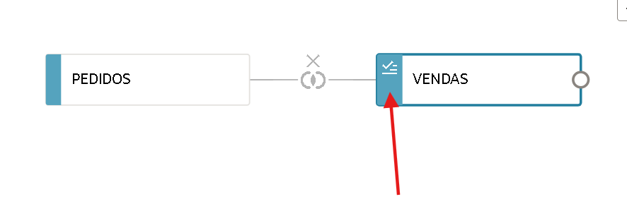

## Tarefa 3: Salvar o Conjunto de Dados

1. Clique no botão de salvar no topo direito da tela (ícone de um disquete).

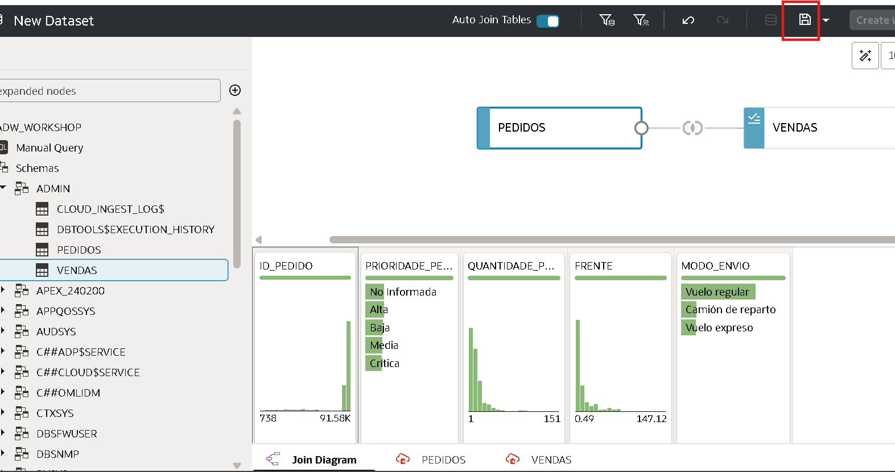

2. Dê um nome para seu dataset e salve na pasta **Projetos**:

> **Obs**: Caso não tenha criado, clique em **New Folder**(nova pasta)

*Nome:* DATASET_WORKSHOP

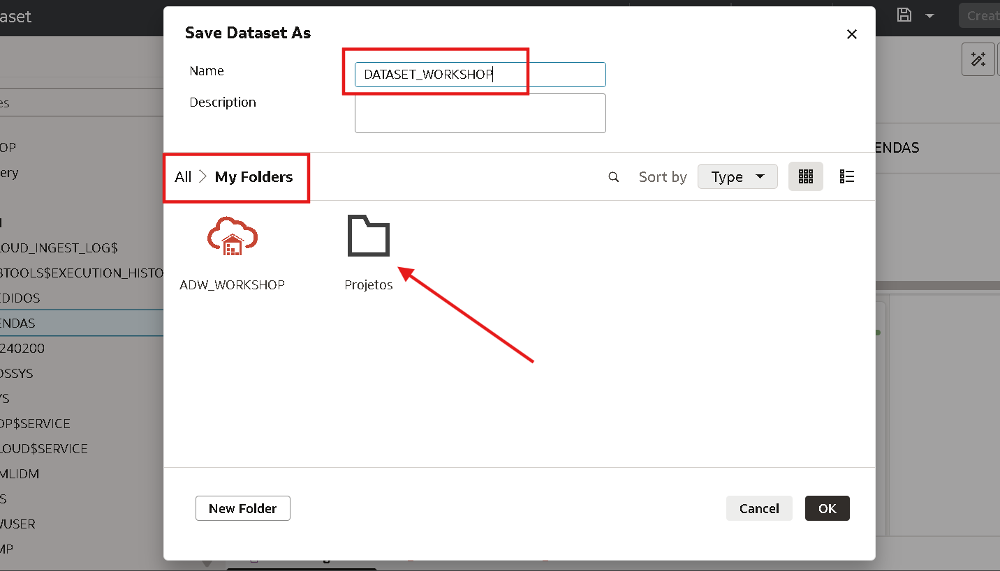

Após está na pasta clique em **Ok** e aguarde salvar.

3. Verifique se você recebeu a mensagem de sucesso e em seguida clique em voltar.

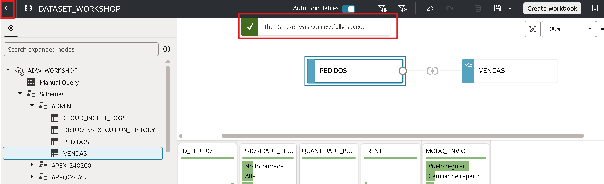

4. Para visualizar seu conjunto de dados salvo, acesse o **Menu ⮕  Data ⮕  Datasets**

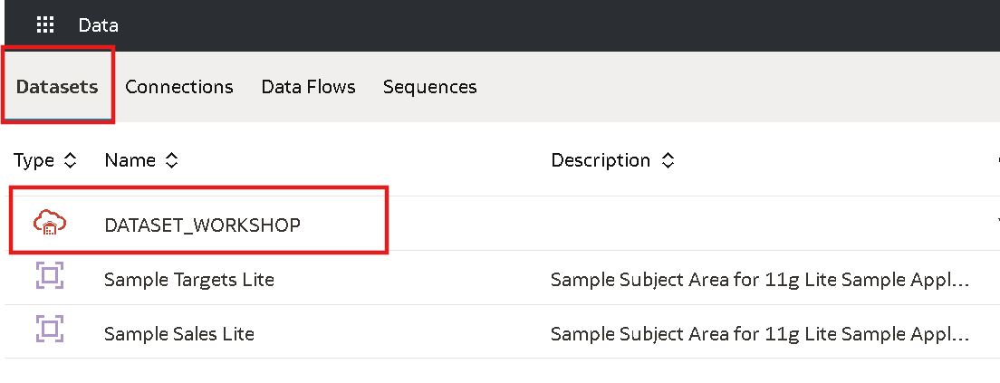

## Conclusão

Nesta sessão você aprendeu criar um Conjunto de Dados no Oracle Analytics Cloud usando mais de uma tabela e aprendeu a utilizar o "Diagrama de Junção".

## Autoria

- **Autores** - Victória Rodrigues
- **Última atualização** - Fevereiro/2026